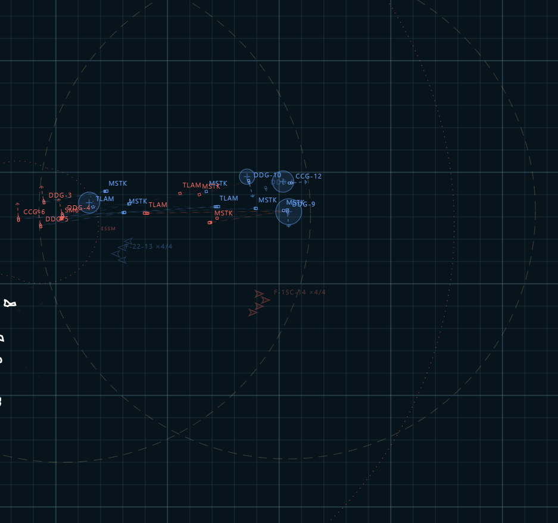
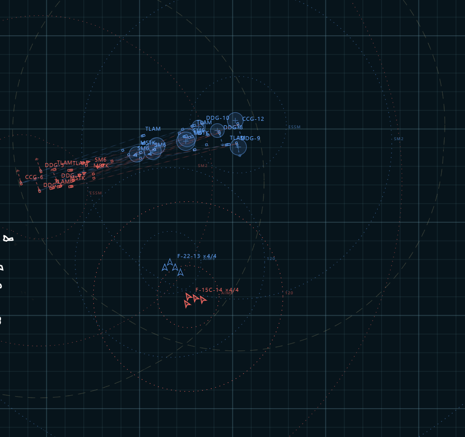

<div align="center">

# ⚓ TomaHawk / 战斧

### A deterministic 2D modern battle simulator — in your browser, no install

[](https://github.com/Panther114/TomaHawk/actions/workflows/ci.yml)
[](CHANGELOG.md)
[](package.json)
[](package.json)
[](tests)
[](LICENSE)
[](#-how-to-play--玩法指南)

Place a Blue and a Red task group — destroyers, cruisers, coastal batteries, radar
sites, fighter squadrons — press play, and watch a fully autonomous command AI
fight a missile war: imperfect radar tracks, cooperative engagement, layered air
defense, saturation strikes, and dogfights. Every run is **byte-for-byte
deterministic**, ships as **plain ES modules with zero dependencies**, and needs
**nothing but Node** to run.

在浏览器中部署蓝、红两方战斗群——驱逐舰、巡洋舰、岸基阵地、雷达站、航空兵中队——按下播放键，
观看一套完全自主的指挥 AI 打一场导弹战：带不确定性的雷达航迹、协同交战、分层防空、饱和打击与
空战格斗。每一局都是**逐字节确定性**的，代码为**零依赖的原生 ES 模块**，除 Node 本身外**无需
任何安装**。

[**▶ One-click deploy**](https://railway.app/new/template?templateUrl=https://github.com/Panther114/TomaHawk) · [Quick start](#-quick-start--快速开始) · [How to play](#-how-to-play--玩法指南) · [Documentation](#-documentation--文档索引)

[](https://railway.app/new/template?templateUrl=https://github.com/Panther114/TomaHawk)

<br>



<sub><em>A live engagement — surface groups trading fire while an F-22 flight and an intruding F-15C close for a dogfight overhead.</em></sub>

</div>

---

## ✨ Highlights

|  |  |
| --- | --- |
| 🧠 **Fully autonomous AI, both sides** | Nothing is scripted move-by-move. Fleet command, target selection, weapon-control state, air-to-air, RTB/rearm — all emergent from the same doctrine on Blue and Red alike. |
| 📡 **Imperfect information** | No unit sees the enemy's true position — only radar *tracks* with quality, uncertainty, and age that decays. Detection range itself scales with target radar cross-section and the geometric radar horizon. |
| 🛰️ **Cooperative Engagement (CEC)** | Every ship on a side fuses its tracks into one shared picture; a ship can fire on a contact its own radar never touched, as long as a teammate is holding it. |
| 🛡️ **Layered defense that actually matters** | Long-range interceptors, fast point defense, and last-ditch CIWS — a lone missile dies reliably, a coordinated saturation raid *will* leak some through. |
| ✈️ **Air units as first-class citizens** | Squadrons scout, fly a low-altitude stand-off strike profile, dogfight with radar/IR missiles, evade and flare, and RTB/rearm/refuel at an airfield on a timer. |
| 🧩 **Fully moddable** | Every ship, ground unit, aircraft, and weapon is data. The built-in **Unit Workshop** lets you create, edit, and share custom units as portable JSON — no code required. |
| 🎲 **Deterministic by construction** | Same seed, same setup, same battle — every time. Genuinely useful for A/B-testing two fleet compositions or two placements head-to-head. |
| 🌐 **Bilingual, zero-install, zero-dependency** | Full English/中文 UI with a one-click toggle. No `npm install`, no bundler, no build step — just Node and a browser. |

---

## 🚀 Quick start / 快速开始

Requirements: a modern Node.js (ES module support, `>=20`) and a desktop
browser. There are **no package dependencies**, so there is nothing to `npm
install`.

要求：支持 ES 模块的现代 Node.js（`>=20`）与桌面浏览器；无软件包依赖，无需 `npm
install`。

```bash
npm start               # serve at http://127.0.0.1:4172
npm run refresh:start   # refresh Natural Earth coastline data, then serve
npm test                # run the deterministic test suite (node --test)
```

> [!TIP]
> On Windows you can also double-click **`quickrun.bat`**: it frees port
> `4172`, starts a fresh server, and opens the browser automatically.
>
> Windows 用户也可双击 **`quickrun.bat`**：释放 `4172` 端口、启动服务并自动打开浏览器。

Once the page loads you'll see a default 4-vs-4 East China Sea scenario (three
destroyers and one cruiser per side) sitting in **setup** mode — press `▶` or
`Space` to start the clock.

页面加载后会看到默认的东海 4 对 4 想定（每方 3 艘驱逐舰 + 1 艘巡洋舰），处于 **setup（部署）**
阶段——按 `▶` 或 `Space` 开始推演。

<div align="center">

<br><sub><em>Air-to-air: an F-22 flight and an F-15C flight closing for the merge, AMRAAM no-escape-zone rings drawn live.</em></sub>
</div>

### Railway deployment / Railway 部署

One-click deploy via the button above: the repository includes a root
`railway.json`, starts with the existing `npm start` script, binds to
Railway's injected `PORT`, and exposes a `/health` endpoint for platform
health checks. Local development is unaffected.

点击上方按钮即可一键部署到 Railway：仓库包含 `railway.json`，沿用现有 `npm start`
启动脚本，兼容 Railway 注入的 `PORT`，并提供 `/health` 健康检查端点；本地开发流程不受影响。

---

## 🎮 How to play / 玩法指南

<details open>
<summary><strong>English</strong></summary>

### 1. The basic loop

A scenario moves through three modes:

| Mode | What you can do |
| --- | --- |
| **setup** | Place, drag, select, and delete units for both sides. Choose the map. Nothing moves or fires yet. |
| **running** | The simulation advances in real time (or fast-forwarded). Every unit senses, decides, and fights on its own — you can pause, single-step, or change speed, but you no longer edit the fleet. |
| **ended** | One side has no unit left alive. The battle is frozen; the surviving side controls the battlespace. |

**Victory condition:** a side loses the instant it has zero living units. There
is no scoring beyond that. Missiles in flight don't count as units, so a side
can win even mid-salvo if the last enemy unit goes down first.

You cannot press play with only one side on the map — the game needs at least
one living Blue **and** one living Red unit to run.

### 2. Setting up your force

- Click **BLUE** or **RED**, pick a unit type from the class dropdown, then
  left-click the map to place it. The dropdown is grouped into **Naval**
  (`DDG`, `CCG`, `BBG`, `FFG`), **Ground** (`SAM`, `CDB`, `EWR`, `AFB`), and
  **Air** (`F22`, `F35A`, `F35C`, `F15E`, `F15N`, `F15C`) — any custom units
  you create in the Unit Workshop show up here too.
- **Terrain matters even in setup.** Naval hulls must go on water; ground
  emplacements must go on land (except airfields, `AFB`, which can sit on
  either). Drop a unit somewhere invalid and it snaps back to the nearest
  legal spot.
- **Left-drag** an already-placed unit to reposition it while still in setup.
- **Right-click** a unit to select it and open its detail card; **right-drag**
  adds more units to that selection (for multi-unit inspection); **right-drag
  on empty water** draws a box select.
- `Delete` / `Backspace` removes every currently selected unit — setup only.
- **`REV`** doesn't just clear the board — it reloads the built-in 4-vs-4 East
  China Sea template from scratch, so it's a fast way to get back to a known
  starting point.
- Switch tactical maps with the map dropdown (**East China Sea** — a real,
  projected coastline, or borderless **Open Sea**). Changing the map is
  setup-only and re-seats every naval unit onto open water.
- Open the **Unit Workshop** (folder icon, top-left) to build custom ships,
  ground emplacements, squadrons, or weapons — see [Modding](#modding--unit-workshop)
  below.

### 3. Controls

| Input | Action |
| --- | --- |
| `Space` | Play / pause (also starts the scenario from setup) |
| `Esc` | Cancel the current tool / clear selection |
| `R` | Toggle the ruler tool (range + bearing; click again to clear all measurements) |
| `Tab` | Cycle the selected ship |
| `` ` `` / `~` | Collapse or expand the tactical feed (event log) |
| `Delete` / `Backspace` | Delete selected units (setup only) |
| Left click | Place a unit (with BLUE/RED tool armed) or select one |
| Right click / right-drag | Select a unit, add to selection, or box-select |
| Middle mouse / `Alt`+drag | Pan the camera |
| Scroll wheel | Zoom in / out |
| Speed slider | Time compression from `1x` to `60x` while running |
| `SAVE` / `LOAD` | Save or load the full scenario as JSON |
| `AAR` | Download an after-action JSON report |
| `COPY FEED` | Copy the formatted tactical log to your clipboard, in the active language |
| 中/EN toggle | Switch the whole UI between English and Chinese instantly |

The map filters (`GRID`, `TRACKS`, `RADAR`, `WEZ`, `WEAPONS`) toggle overlay
layers without affecting the simulation itself — turn off `WEZ` (weapon
engagement zone rings) or `TRACKS` if the picture gets too busy at high unit
counts.

### 4. Order of battle

**Naval hulls** — each has its own speed, turn rate, VLS capacity, and CIWS
strength; heavier hulls carry deeper magazines and more defensive channels but
turn and accelerate more sluggishly.

| Hull | Approximate class | VLS cells | Max speed | Role |
| --- | --- | ---: | ---: | --- |
| `DDG` | Arleigh Burke Flight IIA approx. | 96 | 31 kn | balanced, general-purpose destroyer |
| `CCG` | Ticonderoga-class cruiser approx. | 122 | 32.5 kn | heavier area air defense |
| `BBG` | Arsenal battleship concept approx. | 288 | 24 kn | huge magazine, slow and ponderous |
| `FFG` | Constellation-class frigate approx. | 32 | 26 kn | light, agile, thin margins |

**Fixed ground emplacements** — placed once in setup, never move, never lead
the formation, but sense/share/fire/take damage through the exact same
pipeline as a ship.

| Unit | Role | Radar reach | Default weapons |
| --- | --- | ---: | --- |
| `SAM` | coastal air-defense battery | 160 nm | `SM-2MR`, `SM-6`, `ESSM` |
| `CDB` | coastal anti-ship battery (over-the-horizon radar) | 250 nm | `MaritimeStrike`, `TomahawkBlockV` |
| `EWR` | early-warning radar, unarmed | 400 nm | — |
| `AFB` | airfield: rearm/refuel node for squadrons, placeable on land **or** water | 180 nm | — |

**Air squadrons** — a squadron is **one entity that represents several
aircraft**. Its hit-point pool *is* its surviving plane count: every missile
hit downs exactly one aircraft, and the flight's volley size and relaunch rate
shrink as it takes losses. Each hull's loadout is **rigid** — a fixed,
role-defining weapon set, not a generic multirole budget you configure: an
air-superiority hull never carries a strike weapon, an anti-ground hull never
carries an anti-ship weapon, and vice versa.

| Unit | Role | Radar reach | Default weapons |
| --- | --- | ---: | --- |
| `F22` | 5th-gen air-superiority only (F-22 approx.) | 120 nm | `AIM-120D`, `AIM-9X` |
| `F35A` | 5th-gen dedicated anti-ground strike (F-35A approx.) | 110 nm | `AIM-120D`, `AIM-9X`, `AGM-154` |
| `F35C` | 5th-gen dedicated anti-ship strike (F-35C approx.) | 110 nm | `AIM-120D`, `AIM-9X`, `AGM-84` |
| `F15E` | 4.5-gen dedicated anti-ground strike (F-15E approx.) | 90 nm | `AIM-120C`, `AIM-9X`, `AGM-154` |
| `F15N` | 4.5-gen dedicated anti-ship strike (fictional) | 90 nm | `AIM-120C`, `AIM-9X`, `AGM-84` |
| `F15C` | 4.5-gen air-superiority only (F-15C approx.) | 95 nm | `AIM-120C`, `AIM-9X` |
| `AWAC` | AEW&C — unarmed moving radar, acts as a fleet command hub (E-2D approx.) | 350 nm | — |

The `F22`/`F35A`/`F35C` trio is 5th-gen and low-observable (a much smaller
radar signature, harder to detect); the `F15E`/`F15N`/`F15C` trio is 4.5-gen
and non-stealth, trading signature for the deepest magazines in the roster.
`AWAC` carries no weapons at all and never fights — it is the longest-ranged
mobile radar in the roster, orbits behind the fleet rather than screening
forward, and while it's alive and airborne every ship and squadron on its
side shares tracks with each other noticeably faster (see
[How the AI actually fights](#5-how-the-ai-actually-fights)).

**Weapons** — every missile has a distinct role; nothing is a strict upgrade
of anything else.

| Missile | Map label | Role | Range |
| --- | --- | --- | ---: |
| `SM-2MR` | `SM2` | area air defense (long-range interceptor) | 167 km |
| `ESSM` | `ESSM` | point defense (fast-reloading, quad-packed) | 52 km |
| `SM-6` | `SM6` | dual-role: air defense *or* anti-surface | 370 km |
| `MaritimeStrike` | `MSTK` | dedicated anti-surface cruise missile | 222 km |
| `TomahawkBlockV` | `TLAM` | long-range anti-surface strike | 1,204 km |
| `AIM-120C` | `120C` | BVR active-radar air-to-air | 102 km |
| `AIM-120D` | `120D` | extended-envelope BVR active-radar air-to-air | 152 km |
| `AIM-9X` | `AIM9` | WVR infrared air-to-air (decoyable by flares) | 33 km |
| `AGM-84` | `HPN` | air-launched sea-skimming anti-ship | 124 km |
| `AGM-154` | `JSOW` | air-launched stand-off anti-ground strike | 130 km |

### 5. How the AI actually fights

Nothing on either side is scripted move-by-move — both Blue and Red run the
same autonomous doctrine, and everything below is *emergent* from that
doctrine plus whatever fleet you built. Understanding it is the difference
between "watching a battle" and "winning one."

**Imperfect information.** No unit ever sees the enemy's true position.
Radar produces *tracks*: a position with quality, uncertainty, and age that
decays the longer a contact goes unconfirmed. Detection range itself isn't
fixed — a radar's real reach against a given target scales with that target's
radar cross-section (a stealth fighter squadron is spotted much closer than a
destroyer of the same nominal radar range) and with the geometric radar
horizon (a low sea-skimming missile or a strike aircraft flying low is masked
until it's much closer than a high-flying contact would be — this is why
strike aircraft descend on their final approach). Every alive ship on a side
fuses its own tracks into one shared **Cooperative Engagement (CEC)** picture,
so a multi-ship formation sees more firmly than any single hull alone, and a
ship can fire on a contact its own radar has never touched, as long as a
teammate is holding the track (with a short, realistic network delay before
that shared picture updates).

**Force command.** Each side automatically designates its most air-defense-
capable surviving ship as OTC (formation guide) and the next as AAWC, splits
airspace into AAW sectors along the threat axis, and keeps every other ship
on a screening station around the guide. Lose the OTC and a new one is
elected on the next cycle — the formation will visibly reshuffle around it.

**Doctrine posture.** Each side continuously estimates its own strength
against its *observed* picture of the enemy (never the enemy's real
inventory) and settles into one of four fleet-wide postures, changing with
hysteresis rather than flipping every tick:

| Mode | When it happens | What it looks like |
| --- | --- | --- |
| `survive` | badly outgunned or under heavy missile pressure | minimal, defensive-only raids |
| `focus` | roughly even fight | small, concentrated raids on the single best target |
| `pressure` | a clear but modest advantage | steadier raids split across one or two targets |
| `saturate` | a decisive advantage | deep, wide raids meant to overwhelm defenses outright |

**Layered defense and why saturation works.** Every ship defends itself with
up to three layers: long-range area interceptors (`SM-2MR`/`SM-6`), a faster
point-defense layer (`ESSM`), and a terminal, ammo-limited CIWS as the last
resort. Each layer can only engage so many threats at once. A single missile
gets shot down reliably; a large, coordinated raid — several ships firing in
one aligned salvo rather than dribbling shots independently — will overwhelm
those layers faster than they can reload, and some missiles *will* leak
through. This is exactly why the AI concentrates fire in `saturate` mode
instead of spreading it thin, and why a bigger, more numerous formation with
more pooled interceptor channels survives a raid that would sink a lone ship.

**Air combat.** A squadron on a strike mission flies high to cruise
efficiently, descends to mask itself under the radar horizon on its final
approach, holds a stand-off racetrack just outside the target's defenses to
release its anti-ship weapons, then egresses — it will not fly into a SAM's
engagement envelope. Aircraft dogfight each other with radar (BVR) and
infrared (WVR) missiles, break hard and pop flares when a shot closes in, and
will conservatively spend a reserved anti-air missile to hard-kill an inbound
anti-ship missile if it must. Turn rate and speed are physically grounded — a
flight banks gently in routine transit and only pulls hard performance G in a
genuine dogfight or evasive break, so maneuvering looks like flying, not
snapping. When a squadron runs low on fuel (a distance-aware "bingo fuel"
check against its nearest airfield, not a flat gauge) or expends its strike
weapons, it automatically returns to the nearest friendly airfield, rearms and
refuels on a timer, and relaunches — lose your only airfield and stranded
aircraft will limp toward friendly territory and eventually splash when their
fuel runs out.

**AWACS as a command hub.** `AWAC` is unarmed and never fights — with no
target to chase it orbits *behind* the formation guide, on the side away from
the threat, instead of screening forward like a CAP fighter. While it's alive
and airborne (not down for fuel), its side's ship-to-ship track sharing
tightens from the normal ~1.8s propagation delay to ~0.6s — a real AEW&C
aircraft is a centralized, high-bandwidth relay for the tactical picture, not
just another long-range radar. Losing it (or sending it home to refuel) costs
the whole fleet that edge, not just the one aircraft.

**Rules of engagement.** Every ship carries a weapon-control state — `free`
(fire on any sufficiently identified contact), `tight` (requires a firmer
identification and closer range before releasing), or `hold` (no offensive
fire at all) — but **self-defense is always authorized regardless of that
state**, exactly like real-world ROE: a unit under attack will always shoot
back. (There's currently no in-game control to change a unit's ROE after
setup; it's an internal doctrine input, not a live player lever.)

**Damage.** A hit doesn't just subtract a health point — it also knocks out
2-3 of a ship's six subsystems (radar, VLS, propulsion, fire control, CIWS,
CIC) by a random amount, so a ship that "only" took one hit can come out of
it with a crippled radar or a slowed engine well before it's actually sunk.
Aircraft don't have subsystems; a hit on a squadron just downs one plane.

### 6. Tips for new commanders

- **Concentrate your formation.** Multiple ships pool their interceptor
  channels and their radar tracks (via CEC) — a screen of three ships
  defends far better than three lone ships spread across the map.
- **Protect your radar and airfields.** An EWR or a ship's own radar losing
  health blinds your force; a destroyed airfield strands every squadron that
  depended on it.
- **Don't rely on `SM-6` for offense.** It's the fleet's precious dual-role
  air-defense round; the AI itself conserves it for anti-air work unless your
  magazine is deep or the enemy has nothing left to shoot at you with.
- **Coastlines are real.** On the East China Sea map, ships route around
  land or stop and replan rather than crossing it — don't box your own fleet
  into a bay you can't maneuver out of.
- **Watch subsystem damage, not just hit count.** A ship on its last "HP" can
  already have a dead radar or a crippled engine.
- **A saturating raid beats a bigger raid split thin.** If you're building a
  scenario to test defenses, remember concentration is what actually breaks a
  layered defense — width doesn't.
- **Every run is deterministic.** The same seed and the same setup always
  produce the same battle, which makes TomaHawk a genuinely useful sandbox for
  comparing two fleet compositions or two placements head-to-head.

### Modding — Unit Workshop

Every unit and weapon in TomaHawk is data, not hard-coded — the folder icon
next to the language toggle opens the **Unit Workshop**, where you can create,
edit, import, and export custom `naval`, `ground`, `aircraft`, and `ammo`
records. Custom units are stored in your browser (IndexedDB, nothing leaves
your machine unless you export), flow through the exact same sensor / CEC /
engagement / win pipeline as the built-ins, and can be shared as a `.json`
file by dragging it onto another player's Workshop popup. Vanilla units are
locked (clone them to make an editable copy); only your own custom units can
be edited or deleted. See [`docs/MODDING.md`](docs/MODDING.md) for the full
field-by-field reference.

</details>

<details>
<summary><strong>中文</strong></summary>

### 1. 基本流程

一局想定会经历三种状态：

| 状态 | 你能做什么 |
| --- | --- |
| **setup（部署）** | 为双方部署、拖动、选择、删除单位；切换地图。此阶段一切静止，不会移动或开火。 |
| **running（推演）** | 仿真实时（或加速）推进。每个单位自主感知、决策、开火——你可以暂停、单步、调整速度，但不能再编辑编队。 |
| **ended（结束）** | 一方已无存活单位，战斗冻结，存活方控制战场。 |

**胜负判定：** 一方单位全部阵亡即刻落败，没有其他计分方式。飞行中的导弹不计入“单位”，所以即
便自己正在被齐射攻击，只要先摧毁对方最后一个单位，也能获胜。

只要有一方在地图上没有任何单位，就无法开始推演——双方都必须至少有一个存活单位。

### 2. 部署你的编队

- 点击 **BLUE** 或 **RED**，在类别下拉框中选择单位类型，然后左键点击地图放置。下拉框分为
  **海上**（`DDG`、`CCG`、`BBG`、`FFG`）、**陆基**（`SAM`、`CDB`、`EWR`、`AFB`）与**空中**
  （`F22`、`F35A`、`F35C`、`F15E`、`F15N`、`F15C`）三组；你在单位工坊中自建的单位也会出现在
  这里。
- **部署阶段地形同样生效。** 海上舰艇必须放在水面，陆基阵地必须放在陆地（机场 `AFB` 例外，
  水陆皆可）。放到非法位置会自动吸附回最近的合法位置。
- **左键拖动**已放置的单位可在部署阶段调整位置。
- **右键**点击单位可选中并打开详情卡；**右键拖动**可将更多单位加入选择（便于同时查看多个详情
  卡）；在空白水域**右键拖动**可框选。
- `Delete` / `Backspace` 删除当前选中的所有单位——仅限部署阶段。
- **`REV`** 不只是清空棋盘，而是重新加载内置的东海 4 对 4 想定模板，方便快速回到一个已知的起点。
- 用地图下拉框切换战术地图（真实投影海岸线的**东海**，或无边界的**开放海域**）。切换地图仅限
  部署阶段，且会将所有海上单位重新安置到开阔水域。
- 打开**单位工坊**（左上角文件夹图标）可自建舰艇、陆基阵地、机队或武器——详见下方
  [模组系统](#模组系统--单位工坊)。

### 3. 操作方式

| 输入 | 动作 |
| --- | --- |
| `Space` | 播放 / 暂停（在部署阶段按下会直接开始推演） |
| `.` | 暂停状态下单步推进一个仿真周期（0.25 秒） |
| `Esc` | 取消当前工具 / 清除选择 |
| `R` | 切换标尺工具（距离+方位；再次点击清除全部测量线） |
| `Tab` | 循环切换选中舰艇 |
| `` ` `` / `~` | 收起或展开战术动态（事件日志） |
| `Delete` / `Backspace` | 删除选中单位（仅限部署阶段） |
| 左键 | 放置单位（已选中 BLUE/RED 工具时）或选择单位 |
| 右键 / 右键拖动 | 选中单位、追加选择或框选 |
| 鼠标中键 / `Alt` + 拖动 | 平移视角 |
| 滚轮 | 缩放 |
| 速度滑条 | 推演阶段的时间压缩，`1x` 至 `60x` |
| `SAVE` / `LOAD` | 导出 / 导入完整想定 JSON |
| `AAR` | 导出战后分析 JSON |
| `COPY FEED` | 以当前语言复制格式化的战术日志到剪贴板 |
| 中/EN 切换 | 整个界面在中英文之间即时切换 |

地图过滤开关（`GRID`、`TRACKS`、`RADAR`、`WEZ`、`WEAPONS`）只影响叠加图层显示，不影响仿真本
身——如果单位密集时画面过于杂乱，可以关闭 `WEZ`（武器射程圈）或 `TRACKS`（航迹）。

### 4. 战斗序列

**海上舰艇**——各舰型的航速、转向率、VLS 容量与近防能力各不相同；吨位更大的舰型弹药更深、防
御通道更多，但转向和加速也更迟缓。

| 舰体 | 近似原型 | VLS 单元 | 最高航速 | 定位 |
| --- | --- | ---: | ---: | --- |
| `DDG` | Arleigh Burke Flight IIA 近似型 | 96 | 31 节 | 均衡的通用型驱逐舰 |
| `CCG` | Ticonderoga 巡洋舰近似型 | 122 | 32.5 节 | 更强的区域防空 |
| `BBG` | Arsenal Battleship 概念近似型 | 288 | 24 节 | 超大弹药量，笨重迟缓 |
| `FFG` | Constellation 护卫舰近似型 | 32 | 26 节 | 轻型灵活，余量较薄 |

**固定式陆基阵地**——部署阶段一次性放置，永不移动，不担任编队指挥，但会通过与舰艇完全相同的
流程感知、共享、开火与承受伤害。

| 单位 | 定位 | 雷达距离 | 默认武器 |
| --- | --- | ---: | --- |
| `SAM` | 岸基防空阵地 | 160 海里 | `SM-2MR`、`SM-6`、`ESSM` |
| `CDB` | 岸基反舰阵地（超视距雷达） | 250 海里 | `MaritimeStrike`、`TomahawkBlockV` |
| `EWR` | 早期预警雷达，无武装 | 400 海里 | — |
| `AFB` | 机场：机队的再装挂/加油节点，可部署于陆地**或**水面 | 180 海里 | — |

**空中机队**——一个机队实体代表**多架飞机**。其生命值池即为存活飞机数：每次被命中击落一架，
编队的齐射规模与再出击速度都会随损失而下降。每型飞机的装载都是**固定**的——一套决定其定位
的武器组合，而非可自由配置的通用多用途预算：纯空优机型从不携带对面武器，对地机型从不携带反
舰武器，反舰机型从不携带对地武器。

| 单位 | 定位 | 雷达距离 | 默认武器 |
| --- | --- | ---: | --- |
| `F22` | 5 代纯空优（F-22 近似型） | 120 海里 | `AIM-120D`、`AIM-9X` |
| `F35A` | 5 代专用对地打击（F-35A 近似型） | 110 海里 | `AIM-120D`、`AIM-9X`、`AGM-154` |
| `F35C` | 5 代专用反舰打击（F-35C 近似型） | 110 海里 | `AIM-120D`、`AIM-9X`、`AGM-84` |
| `F15E` | 4.5 代专用对地打击（F-15E 近似型） | 90 海里 | `AIM-120C`、`AIM-9X`、`AGM-154` |
| `F15N` | 4.5 代专用反舰打击（虚构型号） | 90 海里 | `AIM-120C`、`AIM-9X`、`AGM-84` |
| `F15C` | 4.5 代纯空优（F-15C 近似型） | 95 海里 | `AIM-120C`、`AIM-9X` |
| `AWAC` | 预警机——无武装的移动雷达，兼任舰队指挥节点（E-2D 近似型） | 350 海里 | — |

`F22`/`F35A`/`F35C` 三型为 5 代隐身机型（雷达信号小得多，更难被发现）；`F15E`/`F15N`/`F15C`
三型为 4.5 代非隐身机型，以信号换取全阵容中最深的弹药量。`AWAC` 完全无武装、从不参战——它是全
阵容中雷达距离最远的移动平台，在编队后方而非前方警戒，且只要它存活并在空中，同侧所有舰艇与
机队之间的态势共享都会明显更快（见下方[AI 到底是怎么打的](#5-ai-到底是怎么打的)）。

**武器**——每种导弹都有明确定位，彼此之间没有单纯的“升级”关系。

| 导弹 | 地图标签 | 定位 | 射程 |
| --- | --- | --- | ---: |
| `SM-2MR` | `SM2` | 区域防空（远程拦截） | 167 公里 |
| `ESSM` | `ESSM` | 点防御（再装填快、四联装） | 52 公里 |
| `SM-6` | `SM6` | 双用途：防空或对海 | 370 公里 |
| `MaritimeStrike` | `MSTK` | 专用对海巡航导弹 | 222 公里 |
| `TomahawkBlockV` | `TLAM` | 远程对海打击 | 1,204 公里 |
| `AIM-120C` | `120C` | 超视距主动雷达空空导弹 | 102 公里 |
| `AIM-120D` | `120D` | 扩展包线超视距主动雷达空空导弹 | 152 公里 |
| `AIM-9X` | `AIM9` | 近距红外空空导弹（可被诱饵弹欺骗） | 33 公里 |
| `AGM-84` | `HPN` | 机载海面掠飞反舰导弹 | 124 公里 |
| `AGM-154` | `JSOW` | 机载防区外对地打击武器 | 130 公里 |

### 5. AI 到底是怎么打的

双方没有任何逐步脚本化的动作——蓝红两方运行同一套自主条令，下面描述的一切都是这套条令与你
所组建的编队共同“涌现”出来的结果。理解它，是“看一场战斗”和“打赢一场战斗”的区别。

**非完美信息。** 没有任何单位能看到敌方真实坐标。雷达生成的是**航迹**：带质量、不确定性和时
效的坐标估计，长期未被确认的航迹会持续退化。探测距离本身也不是固定值——雷达对某个目标的实际
有效距离会随目标的雷达截面积而变化（隐身机队要比同等雷达标称距离的驱逐舰更晚被发现），也会受
几何雷达地平线影响（低空掠海导弹或低空突防的战机会被地平线遮蔽，直到距离远比高空目标更近才会
现身——这正是打击机群在最后进入阶段要下降高度的原因）。同一阵营中每艘存活舰艇都会把各自的航
迹融合进一张共享的**协同交战（CEC）**态势图，因此多舰编队看到的态势远比单舰更扎实，一艘舰甚至
可以对自己雷达从未捕获过的目标开火，只要队友持有该航迹（共享态势的刷新会有短暂而符合实际的
网络延迟）。

**编队指挥。** 每一方会自动指定其存活舰艇中防空能力最强者为 OTC（编队指挥），次强者为
AAWC（防空指挥），并沿威胁方位划分防空扇区，其余舰艇则在指挥舰周围占据警戒站位。一旦 OTC 阵
亡，下一周期会重新推举新的指挥舰——编队会随之明显重新调整。

**指挥姿态。** 每一方会持续评估自身实力与**观测到**的敌方态势（永远无法得知敌方真实库存），
并（带迟滞地、而非逐帧切换地）进入以下四种全局姿态之一：

| 姿态 | 触发条件 | 表现 |
| --- | --- | --- |
| `survive`（自保） | 明显劣势或承受重导弹压力 | 仅进行最低限度的防御性齐射 |
| `focus`（聚焦） | 大致势均力敌 | 小规模、集中打击单一最优目标 |
| `pressure`（施压） | 具备明显但有限的优势 | 更稳定的齐射，分摊到一到两个目标 |
| `saturate`（饱和） | 拥有压倒性优势 | 深且广的齐射，意在直接压垮对方防御 |

**分层防御与饱和打击为何有效。** 每艘舰艇最多有三层自卫手段：远程区域拦截弹
（`SM-2MR`/`SM-6`）、更快的点防御层（`ESSM`），以及作为最后手段、弹药有限的近防系统。每一层
在同一时间只能应付有限数量的目标。单枚导弹通常会被可靠拦截；而一次大规模、协同的齐射——多艘
舰艇对齐发射窗口、同时来袭，而非各自零散开火——会比防御层再装填更快地将其压垮，必然会有导弹
漏网。这正是 AI 在 `saturate` 姿态下集中火力而非分散打击的原因，也是编队规模更大、可用拦截通
道更多时能扛住足以击沉单舰的齐射的原因。

**空中作战。** 执行打击任务的机队会以高空巡航节省燃料，在最后进入阶段下降以利用雷达地平线隐
蔽自身，在目标防御圈外沿环绕航线保持在防区外发射反舰武器，随后脱离——绝不会主动闯入防空导弹
的交战范围。飞机之间会用雷达（超视距）与红外（近距）导弹格斗，遭遇来袭导弹时会大角度规避机动
并投放红外诱饵，必要时也会保守地消耗一枚预留的空空导弹去硬杀来袭的反舰导弹。转向率与速度都基
于物理法则建模——常规航行中转弯平缓自然，只有在真正的空战格斗或规避机动中才会拉出大过载，因
此机动看起来是在“飞行”，而不是“瞬移”。当机队燃油告急（基于到最近机场实际距离计算的“最低油量”
判断，而非简单看油量百分比）或反舰弹药耗尽时，会自动返回最近的友方机场，按计时再装挂与加油后
重新出击——一旦唯一的机场被摧毁，滞留在外的飞机会尝试飞向友方区域，燃油耗尽后坠海。

**预警机作为指挥节点。** `AWAC` 无武装、从不参战——没有目标可打时，它会在编队指挥舰的**后方**、
远离威胁方位的一侧警戒，而不是像 CAP 战斗机那样在前方警戒。只要它存活并在空中（而非返场加油
中），该侧舰艇间的航迹共享延迟会从常规的约 1.8 秒收紧到约 0.6 秒——真实的预警机是集中式、高
带宽的态势中继节点，而不只是一部更远的雷达。失去它（或让它返场加油）损失的是整个舰队的这项
优势，而不只是这一架飞机。

**交战规则。** 每艘舰艇都带有武器管制状态——`free`（对任何达到识别门槛的目标开火）、`tight`
（需要更确切的识别与更近的距离才会开火）或 `hold`（完全禁止主动开火）——但**无论处于何种状态，
自卫拦截始终被允许**，正如现实中的交战规则：遭到攻击的单位永远可以还击。（目前游戏内没有在部
署完成后修改单位交战规则的界面控件；这是内部条令输入，尚不是玩家可实时操作的开关。）

**毁伤模型。** 一次命中不只是扣掉一点生命值——还会随机使舰艇六个子系统（雷达、VLS、动力、射
控、近防、战情）中的 2-3 个受损，因此一艘“只挨了一下”的舰艇，在真正沉没之前就可能雷达失灵或
动力受限。飞机没有子系统：命中机队只会击落一架飞机。

### 6. 给新指挥官的建议

- **编队要集中。** 多艘舰艇会通过 CEC 共享拦截通道与雷达航迹——三舰组成的警戒屏远比三艘各自
  为战的单舰防御力强得多。
- **保护好雷达与机场。** EWR 或舰载雷达受损会让编队“失明”；机场被摧毁会让依赖它的所有机队无
  处降落。
- **不要指望用 `SM-6` 打进攻。** 它是舰队宝贵的双用途防空弹，AI 自身也会优先为防空保留它，除
  非弹药库足够深，或者敌方已经无力还击。
- **海岸线是真实的。** 在东海地图上，舰艇会绕开陆地航行，或在受阻时停下重新规划航线，而不会
  穿越陆地——不要把自己的编队困在无法机动的海湾里。
- **不要只看命中数，要看子系统损伤。** 一艘“只剩最后一点血”的舰艇可能雷达早已报废或动力已经
  受限。
- **集中打击胜过分散的大齐射。** 如果你在用不同编队测试防御强度，记住真正压垮分层防御的是集
  中火力，而不是齐射的宽度。
- **每一局都是确定性的。** 相同的种子与相同的部署永远会打出相同的战斗，这让战斧非常适合用来
  横向比较两种编队构成或两种部署方式的优劣。

### 模组系统 — 单位工坊

战斧中的每一个单位和武器都是数据，而非写死的代码——语言切换按钮旁的文件夹图标会打开**单位工
坊**，你可以在其中创建、编辑、导入、导出自定义的 `naval`（海上）、`ground`（陆基）、
`aircraft`（空中）与 `ammo`（弹药）记录。自定义单位保存在你的浏览器中（IndexedDB，除非你主
动导出，否则不会离开本机），并会经过与内置单位完全相同的传感器 / CEC / 交战 / 胜负流程；将其
导出为 `.json` 文件后即可拖入另一位玩家的工坊弹窗以分享。内置单位为只读（可克隆出可编辑副
本）；只有你自己创建的自定义单位才能被编辑或删除。完整的逐字段参考见
[`docs/MODDING.md`](docs/MODDING.md)。

</details>

---

## 🔧 Development / 开发

No install step, no bundler — `node --test` is the whole toolchain. All of
these run from the repository root:

无需安装、无需打包工具——`node --test` 就是完整的工具链。以下命令均在仓库根目录运行：

| Command | What it does / 作用 |
| --- | --- |
| `npm start` | Serve the app at `http://127.0.0.1:4172` |
| `npm test` | Run the full deterministic test suite (`node --test`, 179 tests) |
| `npm run bench` | Determinism check + machine-independent complexity/perf regression guard |
| `npm run bench:terrain` | Terrain-navigation benchmark for East China Sea blocked-route movement |
| `npm run bench:frontend` | Render-path performance harness |
| `npm run debug:sim` | Headless run of a large mixed air/ground/naval battle, writing a per-tick performance trace and a human-readable tactical narrative log to `debug/` |
| `npm run map:data` / `npm run refresh:start` | Regenerate the bundled Natural Earth coastline asset |

> [!NOTE]
> The simulation core (`src/sim/`) is **deterministic by construction**: one
> seeded PRNG, no `Date.now()`/`Math.random()` anywhere in the hot path. The
> `bench` script verifies that the same seed always produces a byte-identical
> event stream — this invariant is load-bearing, so any change to `src/sim/`
> should be checked against it before it's considered done.
>
> 仿真核心（`src/sim/`）从设计上就是确定性的：全程仅使用一个带种子的伪随机数生成器，热路径中
> 不存在 `Date.now()`/`Math.random()`。`bench` 脚本会校验相同种子是否始终产生逐字节相同的事
> 件流——这是一条硬约束，任何对 `src/sim/` 的改动完成前都应对照它验证。

New here? Start at [`src/README.md`](src/README.md) for the module map, then
[`docs/ARCHITECTURE.md`](docs/ARCHITECTURE.md) for how the pieces fit
together, and [`AGENTS.md`](AGENTS.md) if you're an AI coding agent navigating
the repo.

刚接触这个项目？先看 [`src/README.md`](src/README.md) 了解模块地图，再看
[`docs/ARCHITECTURE.md`](docs/ARCHITECTURE.md) 了解各部分如何协作；如果你是在此仓库中工作的
AI 编码智能体，请先看 [`AGENTS.md`](AGENTS.md)。

---

## 📁 Repository layout / 仓库结构

```text
./
├── README.md            # this player-facing guide / 本玩家向指南
├── CHANGELOG.md         # release history / 版本记录
├── LICENSE              # PolyForm Noncommercial 1.0.0
├── package.json
├── server.mjs           # local + Railway static server / 本地与 Railway 静态服务
├── railway.json         # Railway one-click deploy config
├── index.html           # UI shell + DOM ids
├── quickrun.bat         # Windows one-click launcher
├── src/
│   ├── README.md        # module map for src/ — read this first
│   ├── app.js           # rendering, input, panels, sim controls
│   ├── styles.css
│   ├── sim.js           # barrel: re-exports the simulation core
│   ├── sim/             # the deterministic simulation core
│   ├── ui/               # presentation helpers, i18n, map data
│   ├── world/             # shared map geometry + terrain queries
│   └── mods/               # Unit Workshop (schema, registry, editor, storage)
├── scripts/                  # bench.mjs, bench-frontend.mjs, perf-harness.mjs, map:data
├── tests/                    # node --test suite (sim, ui, ground-units, air, mods, perf, maps, …)
└── docs/
    ├── screenshots/            # README imagery
    ├── REFERENCE.md            # full bilingual technical manual / 完整中英技术手册
    ├── ARCHITECTURE.md         # module boundaries, rendering/sim split
    ├── DATA_MODEL.md           # object shapes and field meanings
    ├── SIMULATION_ASSUMPTIONS.md
    ├── MODDING.md              # Unit Workshop field-by-field reference
    ├── MAP_DATA.md             # Natural Earth provenance + regeneration
    ├── SOURCES.md              # public-source references and data policy
    ├── ROADMAP.md              # current status / future ideas
    └── NOTES.md                # historical dev notes
```

## 📚 Documentation / 文档索引

| Doc | What's in it |
| --- | --- |
| [`src/README.md`](src/README.md) | Source layout and module map — start here to navigate the code |
| [`docs/REFERENCE.md`](docs/REFERENCE.md) | Full bilingual technical manual (architecture, data model, controls) |
| [`docs/ARCHITECTURE.md`](docs/ARCHITECTURE.md) | Runtime structure, module boundaries, rendering layers |
| [`docs/DATA_MODEL.md`](docs/DATA_MODEL.md) | Object shapes, unit conventions, ship/missile fields |
| [`docs/SIMULATION_ASSUMPTIONS.md`](docs/SIMULATION_ASSUMPTIONS.md) | Modeling assumptions and abstraction policy |
| [`docs/MODDING.md`](docs/MODDING.md) | Unit Workshop: custom units, weapons, and sharing |
| [`docs/MAP_DATA.md`](docs/MAP_DATA.md) | Natural Earth provenance, projection, and regeneration |
| [`docs/SOURCES.md`](docs/SOURCES.md) | Public-source references and data policy |
| [`docs/ROADMAP.md`](docs/ROADMAP.md) | Current capability status and forward-looking ideas |
| [`CHANGELOG.md`](CHANGELOG.md) | Release history (`v0.1` → `v0.3`) |
| [`AGENTS.md`](AGENTS.md) | Navigation guide for AI coding agents |

---

## 📜 License / 许可

Licensed under the **PolyForm Noncommercial License 1.0.0** — see
[`LICENSE`](LICENSE).

You may freely use, copy, modify, and redistribute this software for any
**noncommercial** purpose (personal, hobby, research, education, and other
noncommercial organizations). **Commercial use — including selling the software
or any derivative — is not permitted.** Note that this is a *source-available*
noncommercial license, not an OSI-approved "open source" license (OSI licenses
must permit commercial use).

本项目采用 **PolyForm Noncommercial License 1.0.0**（见 [`LICENSE`](LICENSE)）。允许出于任何
**非商业**目的自由使用、复制、修改与再分发（个人、爱好、研究、教育及其他非营利组织）；**不允许
任何商业用途，包括出售本软件或其衍生作品。** 请注意：这是一份*源代码可见*的非商业许可证，并非
OSI 认证的“开源”许可证（OSI 许可证必须允许商业使用）。

<div align="center">

<sub>Built as a local-first tactical sandbox — no telemetry, no account, no server dependency beyond serving static files.</sub>

[⬆ Back to top](#-tomahawk--战斧)

</div>
