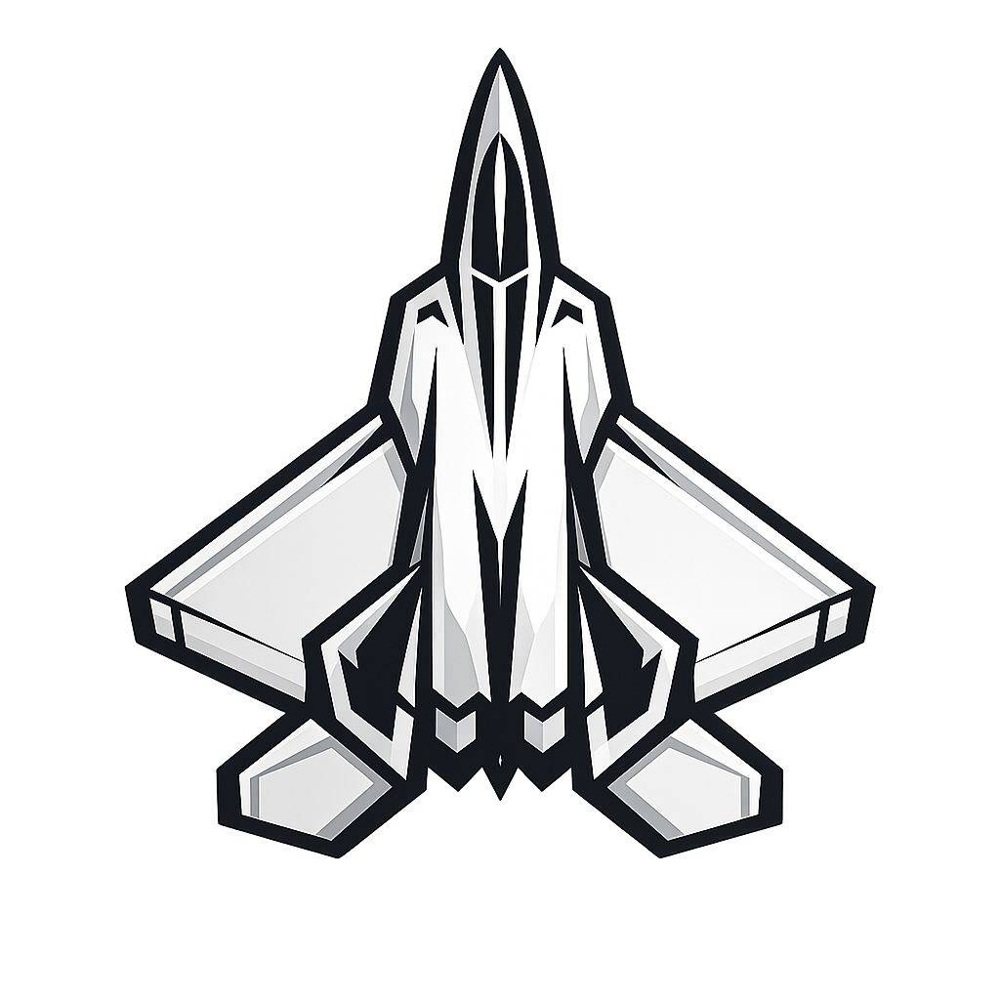
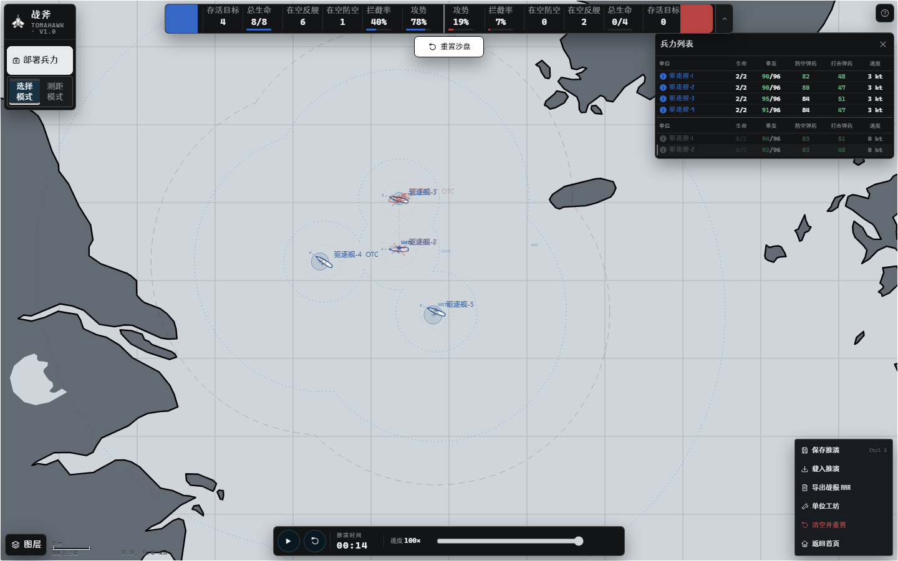
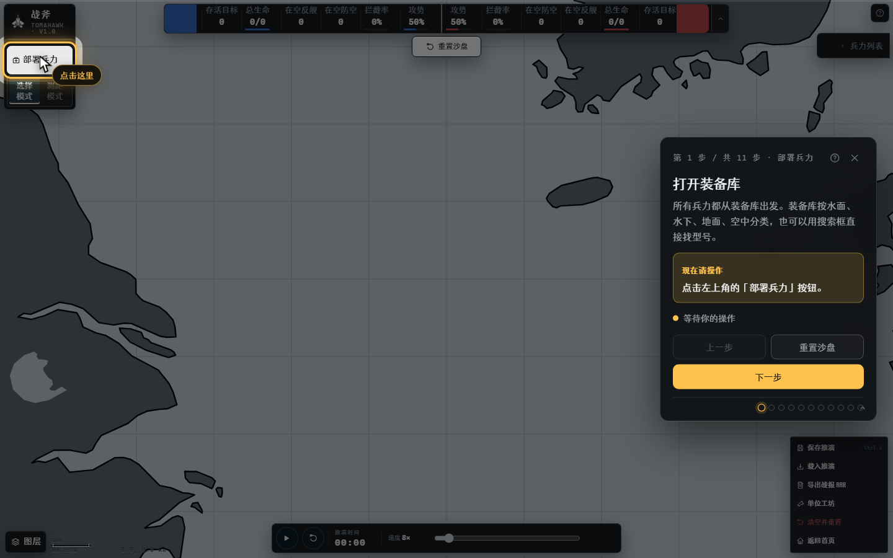
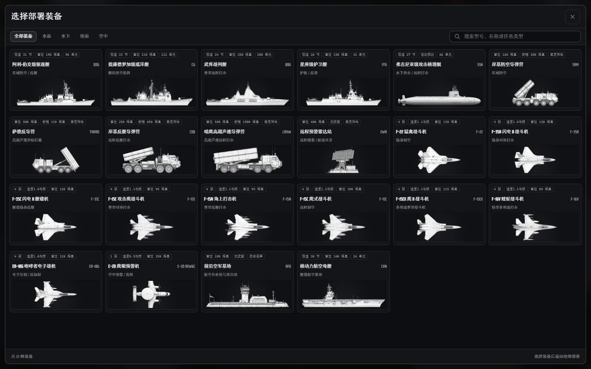
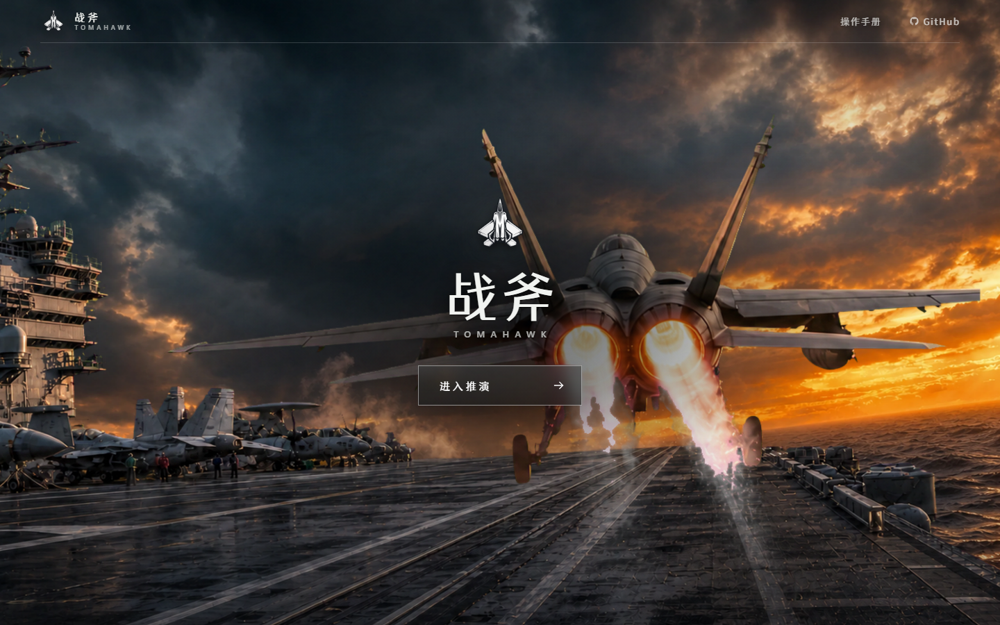

<div align="center">



# 战斧 · Tomahawk

**在浏览器里运行的确定性现代联合作战仿真沙盘**
**A deterministic modern joint-warfare simulation that runs in your browser.**

部署蓝红双方兵力，让传感器、指挥 AI 与武器系统按真实逻辑自主交战。
Deploy blue and red forces, and let sensors, command AI and weapon systems fight it out for real.

[快速开始](#快速开始) · [怎么玩](#怎么玩) · [技术栈](#技术栈) · [特性](#特性) · [文档](#文档)
[Quick Start](#快速开始) · [How to Play](#怎么玩) · [Tech Stack](#技术栈) · [Features](#特性) · [Docs](#文档)

</div>

---

## 这是什么 · What Is This

战斧是一款纯本地运行的现代联合作战推演工具：你在地图上部署水面、水下、地面与空中单位，按下播放后，双方指挥 AI 只依据各自传感器探测到、并共享的航迹自主行动——探测、跟踪、发射、拦截、损伤与弹药消耗都在实时发生。**确定性**：相同的地图、种子与操作，永远得到相同的结果。**纯本地**：没有后端、没有账号、没有隐藏逻辑，推演、存档与自定义单位全部在你的浏览器里完成。

Tomahawk is a fully local modern joint-warfare sandbox. Place surface, subsurface, ground and air units on a real theater map, press play, and the command AIs act only on the tracks their own sensors detect and share — detection, tracking, launch, intercept, damage and magazine drain all happen in real time. **Deterministic**: the same map, seed and inputs always produce the same result. **Fully local**: no backend, no account, no hidden logic — battles, saves and custom units all live in your browser.



*推演进行中：雷达扫描、航迹共享、导弹拦截与弹药消耗实时上演。*
*A battle in progress: radar sweeps, shared tracks, missile intercepts and magazine drain in real time.*

## 快速开始 · Quick Start

需要 Node.js 20 或更高版本，无需安装任何依赖：

Requires Node.js 20 or newer. No third-party dependencies to install:

```bash
npm start
```

然后打开 <http://127.0.0.1:4202>：

Then open <http://127.0.0.1:4202>:

| 页面 Page | 说明 Description |
| --- | --- |
| `/` | 产品首页 Landing page |
| `/sandbox` | 推演沙盘 Sandbox（建议桌面浏览器，内容区至少 960×560） |
| `/guide` | 交互式操作手册 Interactive tutorial |

**新手先打开 `/guide`。** 它不是图文教程，而是一个全屏沉浸式教学台：真实沙盘铺满整个屏幕，金色的光标提示会指向你下一步要点击的位置，每一步只允许操作当前目标，完成操作后自动进入下一步——大约 5 分钟，你就能在正式界面上亲手完成部署、运行、判读与保存。

**New players should start at `/guide`.** It is not a static guide — it is a fullscreen immersive tutorial: the real sandbox fills your screen, a golden cursor points at what to click next, only the current target is clickable, and the tutorial advances automatically when you finish each step. In about five minutes you will have deployed, run, read and saved a real battle yourself.



## 怎么玩 · How to Play

1. 打开沙盘，点击左上角「部署兵力」，为蓝方选择一艘驱逐舰 — Open the sandbox, click 部署兵力 (Deploy) and pick a destroyer for Blue
2. 把光标移到海面上，轮廓变蓝后单击放置；再为红方部署一支兵力（悬停装备卡，点击右侧红色半区）— Click the sea to place it, then give Red a force too
3. 点击底部 ▶ 开始推演，用速度滑杆调速，`Space` 随时暂停 — Press ▶ to start, drag the speed slider, `Space` to pause
4. 点选地图上的单位，在右侧查看生命、任务与剩余弹药 — Select units to read their health, task and remaining ordnance
5. 需要长期保存？右下角系统工具 →「保存推演」— Save your battle from the system tools menu



## 技术栈 · Tech Stack

- **纯前端** · **Pure frontend**：HTML / CSS / JavaScript（ES Modules），零构建、零运行时依赖
- **Canvas 2D** 战术地图渲染 + 轻量 DOM HUD · tactical map rendering with a lightweight DOM HUD
- **Node.js** 静态服务器（Railway 一键部署）· static server, one-click Railway deploy
- **Playwright** 驱动的自动化回归测试 · automated regression testing
- **确定性仿真核心** `src/sim/`：DOM 无关，可直接在 Node 中运行与测试 · deterministic sim core, DOM-free and directly testable in Node

## 特性 · Features

- 联合作战单位：水面舰艇、潜艇、地面阵地、机场与航空兵编队 · naval, subsurface, ground and air units
- 传感器与航迹：雷达、声呐、ESM、雷达地平线、RCS、航迹老化与跨单位共享 · radar, sonar, ESM, radar horizon, RCS and track sharing
- 协同交战（CEC）：共享目标火力与超视距拦截 · cooperative engagement with over-the-horizon intercepts
- 分层防空、近防、反舰、对陆打击、反潜与高超音速攻防 · layered air defence, point defence, strike, ASW and hypersonic offence/defence
- 航空后勤：燃油、返航、再装填、航母甲板与机场支援 · aircraft fuel, RTB, rearm, carrier deck and airfield support
- 电子对抗：电子攻击、烧穿、反辐射压制与软杀伤 · electronic attack, burn-through and soft-kill decoys
- 子系统损伤、编组损耗与弹药耗尽 · subsystem damage, attrition and magazine exhaustion
- 本地单位工坊：自定义单位并保存进装备库 · a local unit workshop for custom units



战斧不是经过验证的任务规划或作战分析工具，也不建模雷场、后勤、天气海况与人员训练；公开装备参数为基于公开资料的工程抽象。

Tomahawk is not a validated mission-planning or operational-analysis tool. It does not model mines, logistics, weather or crew training; public equipment parameters are engineering abstractions built from open sources.

## 项目结构 · Project Structure

- `sandbox.html` + `src/app.js` — 推演沙盘界面 · sandbox UI (canvas rendering and interaction)
- `guide.html` + `src/guide.js` — 交互式操作手册 · immersive tutorial engine embedding the real sandbox
- `src/sim/` — 确定性仿真核心 · deterministic simulation core
- `src/mods/` — 单位工坊与本地存储 · unit workshop and local storage
- `server.mjs` — 轻量静态文件服务器 · lightweight static file server
- `tests/` — 规则、持久化、UI 与性能回归测试 · rules, persistence, UI and performance regression tests

## 文档 · Documentation

- [玩家指南 Player Guide](docs/PLAYER_GUIDE.md) · [架构 Architecture](docs/ARCHITECTURE.md) · [仿真模型 Simulation](docs/SIMULATION.md) · [单位工坊与 Mod Modding](docs/MODDING.md) · [更新日志 Changelog](CHANGELOG.md)

## 许可 · License

代码以 [PolyForm Noncommercial 1.0.0](LICENSE) 许可发布。真实装备名称仅用于指代仿真对象，不代表任何厂商、机构或部门的背书。

Code is released under the [PolyForm Noncommercial 1.0.0](LICENSE) license. Real equipment names only identify simulated objects and do not imply endorsement by any manufacturer, service or agency.
